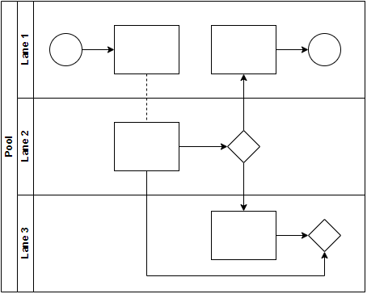
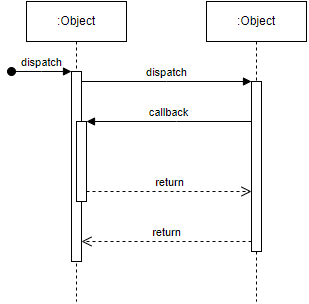
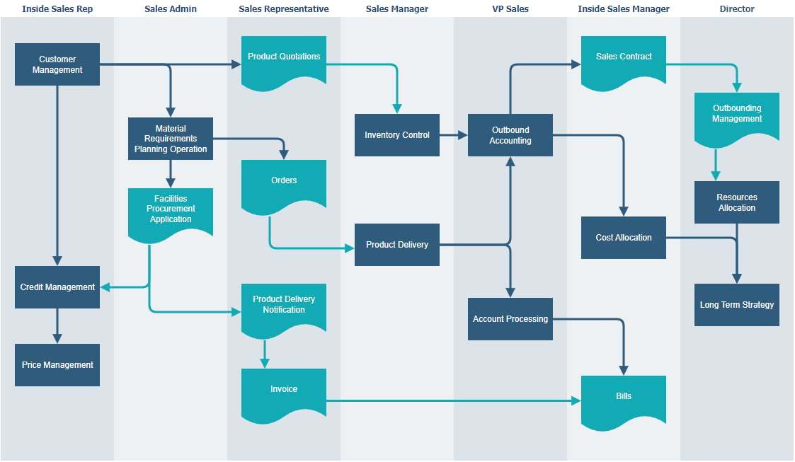
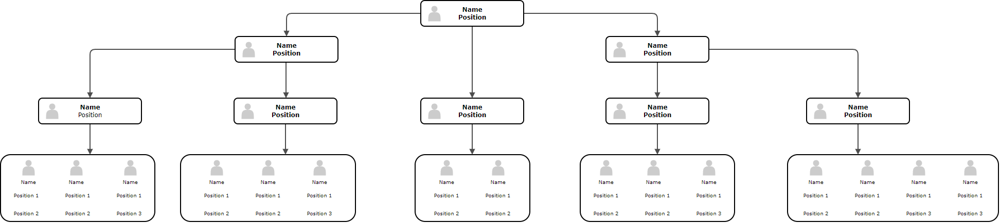
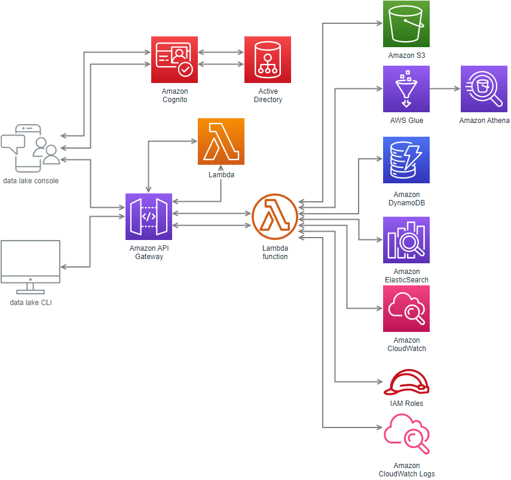
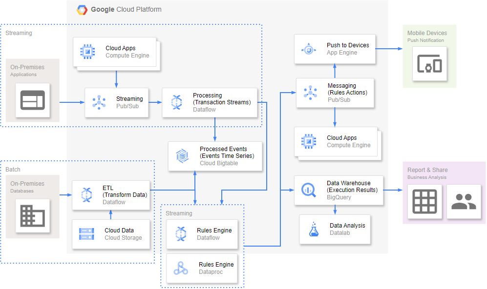
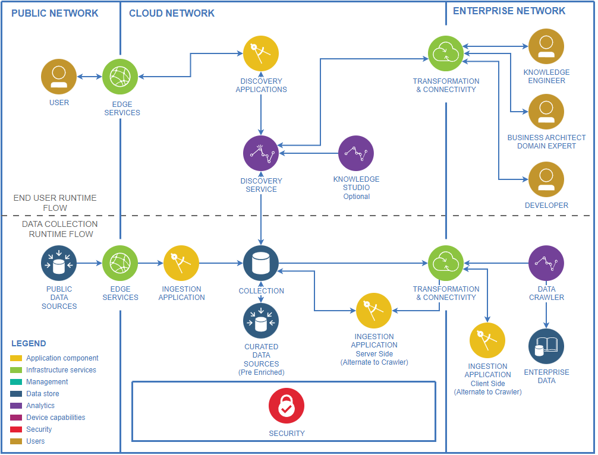
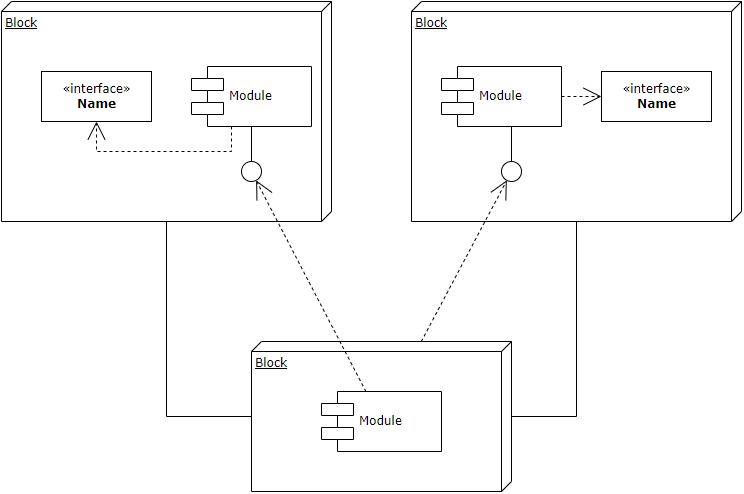
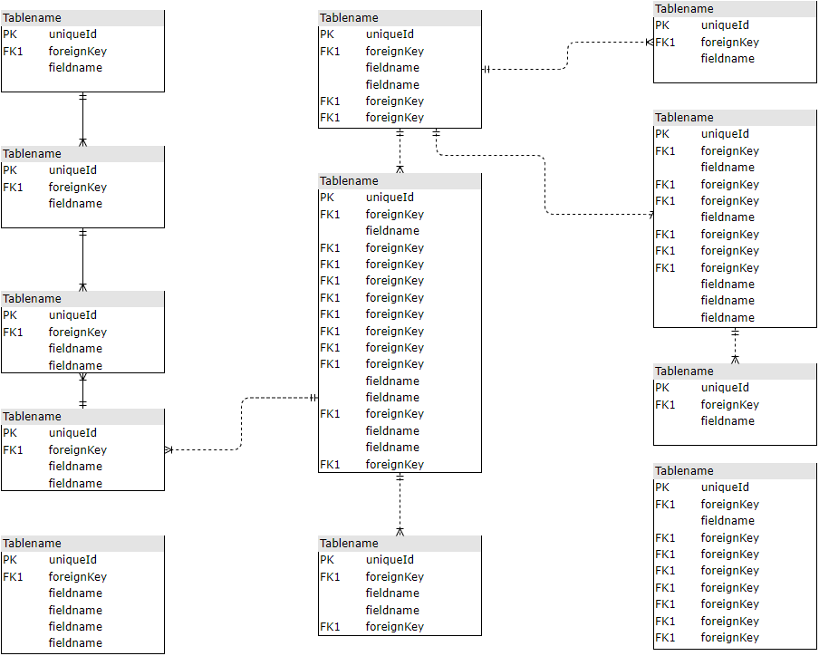

# Draw.io Templates List <!-- omit in toc -->

Draw.io のテンプレートを挿入するとき、どんな図があるのか一覧で見たかったり、図を大きくしてみたくなったことはありませんか？
このリポジトリは、そのような状況で、テンプレートの一覧をわかりやすく確認するために、PNG 画像に変換したテンプレートの一覧をまとめています。

## 参考情報 <!-- omit in toc -->

- テンプレートの一覧は Draw.io 26.0.15 のものです。
- テンプレートの XML(mxfile 形式)から PNG への変換には drawio-desktop を利用しています。
- 見出しは Draw.io の表示名と一致していますが、意味が分かりにくいものは後ろに`# {和訳}`や`# {図の名称}`をつけています。

## 目次 <!-- omit in toc -->

- [基本](#基本)
  - [クラス図](#クラス図)
  - [フローチャート](#フローチャート)
  - [組織図](#組織図)
  - [スイムレーン](#スイムレーン)
  - [ER 図](#er-図)
  - [Sequence Diagram #シーケンス図](#sequence-diagram-シーケンス図)
  - [Simple Kanban Board #カンバンボード](#simple-kanban-board-カンバンボード)
  - [Cross-Functional Flowchart #部門間連携フローチャート](#cross-functional-flowchart-部門間連携フローチャート)
  - [所有者](#所有者)
  - [マインドマップ](#マインドマップ)
- [ビジネス](#ビジネス)
  - [Accd #インバウンドマーケティング](#accd-インバウンドマーケティング)
  - [Archimate](#archimate)
  - [Bpmn #ビジネスプロセスモデリング表記法](#bpmn-ビジネスプロセスモデリング表記法)
  - [Business model 1](#business-model-1)
  - [Business model 2](#business-model-2)
  - [Business model canvas 1 #ビジネスモデルキャンバス](#business-model-canvas-1-ビジネスモデルキャンバス)
  - [Ishikawa 1 #特性要因図, 魚の骨図, fishbone diagram](#ishikawa-1-特性要因図-魚の骨図-fishbone-diagram)
  - [Ishikawa 2 #特性要因図, 魚の骨図, fishbone diagram](#ishikawa-2-特性要因図-魚の骨図-fishbone-diagram)
  - [Pert 1 #PERT 図,パート図](#pert-1-pert-図パート図)
  - [Pert 2 #PERT 図,パート図](#pert-2-pert-図パート図)
  - [Swimlane #スイムレーン](#swimlane-スイムレーン)
  - [Timeline 1](#timeline-1)
  - [Timeline 2](#timeline-2)
  - [Timeline 3](#timeline-3)
  - [Timeline 4](#timeline-4)
- [チャート](#チャート)
  - [Bar chart 1 #棒グラフ](#bar-chart-1-棒グラフ)
  - [coc #Chain of Command, 指揮系統](#coc-chain-of-command-指揮系統)
  - [Org chart 1 #組織図](#org-chart-1-組織図)
  - [Org chart 2 #組織図](#org-chart-2-組織図)
  - [Work breakdown structure](#work-breakdown-structure)
  - [Process Bar](#process-bar)
- [Cloud / AWS](#cloud--aws)
  - [Aws 1](#aws-1)
  - [Aws 2](#aws-2)
  - [Aws 3](#aws-3)
  - [Aws 4](#aws-4)
  - [Aws 5](#aws-5)
  - [Aws 6](#aws-6)
  - [Aws 7](#aws-7)
  - [Aws 8](#aws-8)
  - [Aws 9](#aws-9)
  - [Aws 10](#aws-10)
  - [Aws 3d](#aws-3d)
- [Cloud / Azure](#cloud--azure)
  - [Azure 1](#azure-1)
  - [Azure 2](#azure-2)
  - [Azure 3](#azure-3)
  - [Azure 4](#azure-4)
  - [Azure 5](#azure-5)
  - [Azure 6](#azure-6)
  - [Azure 7](#azure-7)
  - [Azure 8](#azure-8)
  - [Azure 9](#azure-9)
- [Cloud / GCP](#cloud--gcp)
  - [Gcp backup and archive api hosting](#gcp-backup-and-archive-api-hosting)
  - [gcp_big_data_complex_event_processing](#gcp_big_data_complex_event_processing)
  - [gcp_dev_test_continuous_delivery_with_spinnaker](#gcp_dev_test_continuous_delivery_with_spinnaker)
  - [gcp_digital_marketing_dmp_data_warehouse](#gcp_digital_marketing_dmp_data_warehouse)
  - [gcp_financial_services_monte_carlo_simulations](#gcp_financial_services_monte_carlo_simulations)
  - [gcp_gaming_backend_database](#gcp_gaming_backend_database)
  - [gcp_general_app_engine_and_cloud_endpoints](#gcp_general_app_engine_and_cloud_endpoints)
  - [gcp_internet_of_things_mqtt_to_pubsub_broker](#gcp_internet_of_things_mqtt_to_pubsub_broker)
  - [gcp_lifesciences_genomics_secondary_analysis](#gcp_lifesciences_genomics_secondary_analysis)
  - [gcp_media_hybrid_rendering](#gcp_media_hybrid_rendering)
  - [gcp_retail_beacons_and_targeted_marketing](#gcp_retail_beacons_and_targeted_marketing)
  - [gcp_websites_content_hosting](#gcp_websites_content_hosting)
- [Cloud / IBM](#cloud--ibm)
  - [ibm_bda_reference_architecture](#ibm_bda_reference_architecture)
  - [ibm_blockchain](#ibm_blockchain)
  - [ibm_cognitive_conversation](#ibm_cognitive_conversation)
  - [ibm_cognitive_discovery](#ibm_cognitive_discovery)
  - [ibm_iot_architecture](#ibm_iot_architecture)
  - [ibm_microservices](#ibm_microservices)
  - [ibm_private_cloud](#ibm_private_cloud)
  - [ibm_vcenter_server_platform](#ibm_vcenter_server_platform)
  - [ibm_vpc_architecture](#ibm_vpc_architecture)
- [エンジニアリング](#エンジニアリング)
  - [cabinet](#cabinet)
  - [electrical_1](#electrical_1)
  - [electrical_2](#electrical_2)
- [フローチャート](#フローチャート-1)
  - [Cross functional flowchart 1 #組織間連携フローチャート](#cross-functional-flowchart-1-組織間連携フローチャート)
  - [Cross functional flowchart 2 #組織間連携フローチャート](#cross-functional-flowchart-2-組織間連携フローチャート)
  - [Data flow 1 #DFD 図、データフロー図](#data-flow-1-dfd-図データフロー図)
  - [Data flow 2 #DFD 図、データフロー図](#data-flow-2-dfd-図データフロー図)
  - [Data flow 3 #DFD 図、データフロー図](#data-flow-3-dfd-図データフロー図)
  - [epc #イベントフロー図,プロセスチェーン図](#epc-イベントフロー図プロセスチェーン図)
  - [Flowchart 1 #フローチャート](#flowchart-1-フローチャート)
  - [Flowchart 2 #フローチャート](#flowchart-2-フローチャート)
  - [Workflow 1 #ワークフロー](#workflow-1-ワークフロー)
- [Maps](#maps)
  - [Concept map 1 #概念図](#concept-map-1-概念図)
  - [Concept map 2 #概念図](#concept-map-2-概念図)
  - [Living beings mind map](#living-beings-mind-map)
  - [Mind map](#mind-map)
  - [Site map](#site-map)
- [network](#network)
  - [Active directory](#active-directory)
  - [Arista](#arista)
  - [Cisco 1](#cisco-1)
  - [Cisco 2](#cisco-2)
  - [Citrix](#citrix)
  - [Enterprise 1](#enterprise-1)
  - [Fortinet](#fortinet)
  - [Internet](#internet)
  - [Lan](#lan)
  - [Network](#network-1)
  - [Telecomm](#telecomm)
  - [Veeam](#veeam)
  - [Wireless home network](#wireless-home-network)
- [その他](#その他)
  - [Block](#block)
  - [Cycle 1](#cycle-1)
  - [Decision tree #決定木](#decision-tree-決定木)
  - [Delivery diagram](#delivery-diagram)
  - [Educational #時間割](#educational-時間割)
  - [Floor plan #間取り図](#floor-plan-間取り図)
  - [Infographic 1](#infographic-1)
  - [Infographic 2](#infographic-2)
  - [Infographic 3](#infographic-3)
  - [Infographic 4](#infographic-4)
  - [Lan plan #LAN 配線図](#lan-plan-lan-配線図)
  - [Water cycle #ウォーターサイクル、水循環](#water-cycle-ウォーターサイクル水循環)
- [ソフトウェア](#ソフトウェア)
  - [Class 1 #クラス図](#class-1-クラス図)
  - [Class 2 #クラス図](#class-2-クラス図)
  - [Component #コンポーネント図](#component-コンポーネント図)
  - [Database 1 #ER 図](#database-1-er-図)
  - [Database 2 #ER 図](#database-2-er-図)
  - [Database 3 #ER 図](#database-3-er-図)
  - [Eip #エンタープライズ統合パターン、EIP](#eip-エンタープライズ統合パターンeip)
  - [Entity relationship #ER 図](#entity-relationship-er-図)
  - [Git flow 1](#git-flow-1)
  - [Git flow 2](#git-flow-2)
  - [Git flow 3](#git-flow-3)
  - [Data flow 1 #DFD 図](#data-flow-1-dfd-図)
- [Tables](#tables)
  - [Authority matrix #権限マトリクス、権限定義表](#authority-matrix-権限マトリクス権限定義表)
  - [Gantt 1 #ガントチャート](#gantt-1-ガントチャート)
  - [Gantt 2 #ガントチャート](#gantt-2-ガントチャート)
  - [Gantt 3 #ガントチャート](#gantt-3-ガントチャート)
- [UML](#uml)
  - [Activity diagram 1 #アクティビティ図](#activity-diagram-1-アクティビティ図)
  - [Activity diagram 2 #アクティビティ図](#activity-diagram-2-アクティビティ図)
  - [Sequence 1 #シーケンス図](#sequence-1-シーケンス図)
  - [Sequence 2 #シーケンス図](#sequence-2-シーケンス図)
  - [Statemachine #ステートマシン図](#statemachine-ステートマシン図)
  - [Sysml #要求図、Requirement Diagram](#sysml-要求図requirement-diagram)
  - [Uml 1 #オブジェクト図](#uml-1-オブジェクト図)
  - [Uml 2 #パッケージ図](#uml-2-パッケージ図)
- [venn #ベン図](#venn-ベン図)
  - [Spider 1 #Spider diagram、オイラー図拡張](#spider-1-spider-diagramオイラー図拡張)
  - [Spider 2 #Spider diagram、オイラー図拡張](#spider-2-spider-diagramオイラー図拡張)
  - [Venn 1 #ベン図](#venn-1-ベン図)
  - [Venn 2 #ベン図](#venn-2-ベン図)
  - [Venn 3 #ベン図](#venn-3-ベン図)
  - [Venn 4 #ベン図](#venn-4-ベン図)
  - [Venn 5 #ベン図](#venn-5-ベン図)
  - [Venn 6 #ベン図](#venn-6-ベン図)
- [ワイヤーフレーム](#ワイヤーフレーム)
  - [Blog 1](#blog-1)
  - [Bootstrap 1 #ブートストラップ・ワイヤーフレーム](#bootstrap-1-ブートストラップワイヤーフレーム)
  - [Home page hero video 1 #ヒーローイメージ](#home-page-hero-video-1-ヒーローイメージ)
  - [Home page 1](#home-page-1)
  - [Home page 2](#home-page-2)
- [レイアウト](#レイアウト)
  - [Blog wireframe](#blog-wireframe)
  - [Bootstrap](#bootstrap)
  - [Wireframe 1](#wireframe-1)
  - [Wireframe 2](#wireframe-2)

## 基本

### クラス図

### フローチャート

### 組織図

### スイムレーン

### ER 図

### Sequence Diagram #シーケンス図

### Simple Kanban Board #カンバンボード

### Cross-Functional Flowchart #部門間連携フローチャート

### 所有者

### マインドマップ

## ビジネス

### Accd #インバウンドマーケティング

### Archimate

### Bpmn #ビジネスプロセスモデリング表記法

### Business model 1

### Business model 2

### Business model canvas 1 #ビジネスモデルキャンバス

### Ishikawa 1 #特性要因図, 魚の骨図, fishbone diagram

### Ishikawa 2 #特性要因図, 魚の骨図, fishbone diagram

### Pert 1 #PERT 図,パート図

### Pert 2 #PERT 図,パート図

### Swimlane #スイムレーン

### Timeline 1

### Timeline 2

### Timeline 3

### Timeline 4

## チャート

### Bar chart 1 #棒グラフ

### coc #Chain of Command, 指揮系統

### Org chart 1 #組織図

### Org chart 2 #組織図

### Work breakdown structure

### Process Bar

## Cloud / AWS

### Aws 1

### Aws 2

### Aws 3

### Aws 4

### Aws 5

### Aws 6

### Aws 7

### Aws 8

### Aws 9

### Aws 10

### Aws 3d

## Cloud / Azure

### Azure 1

### Azure 2

### Azure 3

### Azure 4

### Azure 5

### Azure 6

### Azure 7

### Azure 8

### Azure 9

## Cloud / GCP

### Gcp backup and archive api hosting

### gcp_big_data_complex_event_processing

### gcp_dev_test_continuous_delivery_with_spinnaker

### gcp_digital_marketing_dmp_data_warehouse

### gcp_financial_services_monte_carlo_simulations

### gcp_gaming_backend_database

### gcp_general_app_engine_and_cloud_endpoints

### gcp_internet_of_things_mqtt_to_pubsub_broker

### gcp_lifesciences_genomics_secondary_analysis

### gcp_media_hybrid_rendering

### gcp_retail_beacons_and_targeted_marketing

### gcp_websites_content_hosting

## Cloud / IBM

### ibm_bda_reference_architecture

### ibm_blockchain

### ibm_cognitive_conversation

### ibm_cognitive_discovery

### ibm_iot_architecture

### ibm_microservices

### ibm_private_cloud

### ibm_vcenter_server_platform

### ibm_vpc_architecture

## エンジニアリング

### cabinet

### electrical_1

### electrical_2

## フローチャート

### Cross functional flowchart 1 #組織間連携フローチャート

### Cross functional flowchart 2 #組織間連携フローチャート

### Data flow 1 #DFD 図、データフロー図

### Data flow 2 #DFD 図、データフロー図

### Data flow 3 #DFD 図、データフロー図

### epc #イベントフロー図,プロセスチェーン図

### Flowchart 1 #フローチャート

### Flowchart 2 #フローチャート

### Workflow 1 #ワークフロー

## Maps

### Concept map 1 #概念図

### Concept map 2 #概念図

### Living beings mind map

### Mind map

### Site map

## network

### Active directory

### Arista

### Cisco 1

### Cisco 2

### Citrix

### Enterprise 1

### Fortinet

### Internet

### Lan

### Network

### Telecomm

### Veeam

### Wireless home network

## その他

### Block

### Cycle 1

### Decision tree #決定木

### Delivery diagram

### Educational #時間割

### Floor plan #間取り図

### Infographic 1

### Infographic 2

### Infographic 3

### Infographic 4

### Lan plan #LAN 配線図

### Water cycle #ウォーターサイクル、水循環

## ソフトウェア

### Class 1 #クラス図

### Class 2 #クラス図

### Component #コンポーネント図

### Database 1 #ER 図

### Database 2 #ER 図

### Database 3 #ER 図

### Eip #エンタープライズ統合パターン、EIP

### Entity relationship #ER 図

### Git flow 1

### Git flow 2

### Git flow 3

### Data flow 1 #DFD 図

## Tables

### Authority matrix #権限マトリクス、権限定義表

### Gantt 1 #ガントチャート

### Gantt 2 #ガントチャート

### Gantt 3 #ガントチャート

## UML

### Activity diagram 1 #アクティビティ図

### Activity diagram 2 #アクティビティ図

### Sequence 1 #シーケンス図

### Sequence 2 #シーケンス図

### Statemachine #ステートマシン図

### Sysml #要求図、Requirement Diagram

### Uml 1 #オブジェクト図

### Uml 2 #パッケージ図

## venn #ベン図

### Spider 1 #Spider diagram、オイラー図拡張

### Spider 2 #Spider diagram、オイラー図拡張

### Venn 1 #ベン図

### Venn 2 #ベン図

### Venn 3 #ベン図

### Venn 4 #ベン図

### Venn 5 #ベン図

### Venn 6 #ベン図

## ワイヤーフレーム

### Blog 1

### Bootstrap 1 #ブートストラップ・ワイヤーフレーム

### Home page hero video 1 #ヒーローイメージ

### Home page 1

### Home page 2

## レイアウト

### Blog wireframe

### Bootstrap

### Wireframe 1

### Wireframe 2

